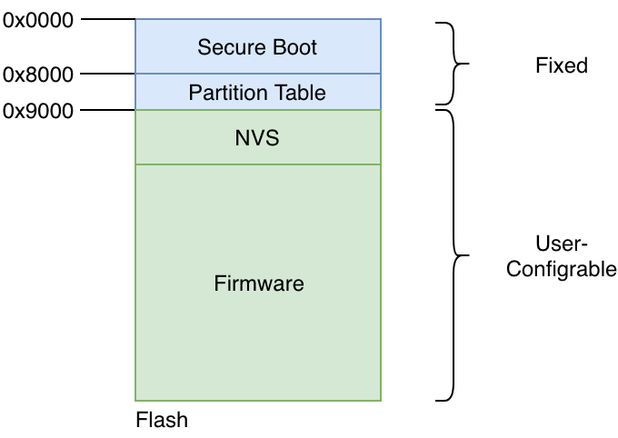
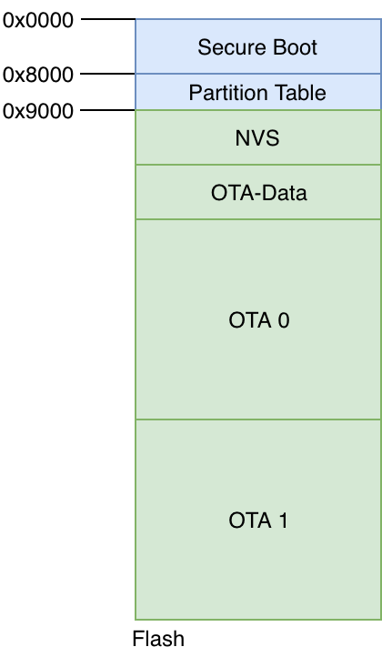
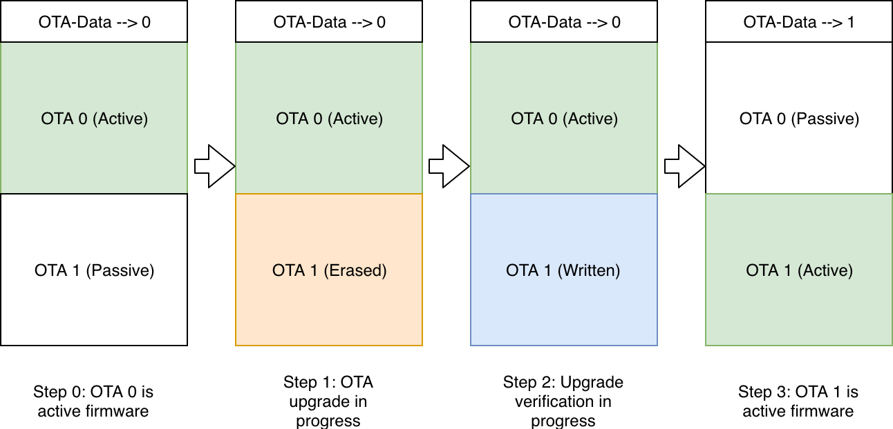

Firmware Upgrades
=================

Before we discuss firmware upgrades, one pertinent topic that needs to
be discussed is the flash partitions.

Flash Partitions
----------------

The ESP-IDF framework divides the flash into multiple logical partitions
for storing various components. The typical way this is done is shown in
the figure [fig:flash\_parts].

   Flash Partitions Structure

As can be seen, the structure is static upto flash address 0x9000. The
first part of the flash contains the second-stage bootloader, which is
immediately followed by the partition table. The partition table then
stores how the rest of the flash should be interpreted. Typically an
installation will have at-least 1 NVS partition and 1 firmware
partition.

OTA Mechanism
-------------

For firmware upgrades, an active-passive partition scheme is used. Two
flash partitions are reserved for the ’firmware’ component, as shown in
the figure [fig:ota\_flash\_parts]. The OTA Data partition remembers
which of these is the active partition.

   OTA Flash Partitions

The typical state changes across the OTA firmware upgrade happens as
shown in the figure [fig:ota\_workflow]. Behind the scene the following
steps occur during the OTA upgrade workflow:

-  Step 0: OTA 0 is the active firmware. The OTA data partition stores
   this information as indicated.

-  Step 1: The firmware upgrade process begins. The passive partition is
   identified, erased and new firmware is being written the OTA 1.

-  Step 2: The firmware upgrade is completely written and verification
   is in-progress.

-  Step 3: The firmware upgrade is successful, the OTA data partition is
   updated to indicate that OTA 1 is now the active partition. On the
   next boot-up the firmware from this partition will boot.

   Firmware Upgrade Flow

The Code
--------

Let’s check the code for enabling this functionality.

.. code:: c

        esp_http_client_config_t config = {
            .url = url,
            .cert_pem = (char *)upgrade_server_cert_pem_start,
        };
        esp_err_t ret = esp_https_ota(&config);

-  The *esp\_http\_client\_config\_t* structure is used to define the
   OTA upgrade source. This includes the URL that should be upgraded
   from, and also the CA certificate for validating the server from
   which the upgrade should be fetched. Please note that it is quite
   critical to ensure the validation of the CA certificate as mentioned
   in the Section [sec:security\_first].

-  The API *esp\_https\_ota()* is then executed which initiates the
   firmware upgrade. When the firmware upgrade process is successful (or
   fails), this API returns with the appropriate error code.

The open question is how does the device receive the upgrade URL. The
firmware upgrade command is typically different from the remote-control
commands discussed in the earlier section. This is because the firmware
upgrade is generally triggered by the device manufacturer for a batch or
group of devices as they have identified.

You as the manufacturer can make the best choice about the appropriate
manner for delivering the firmware upgrade notification to the device,
and then calling the *esp\_https\_ota()* API.
