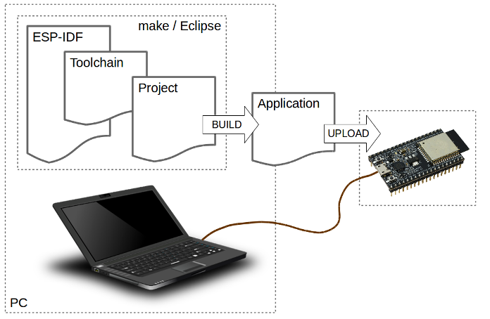

**Building Products with ESP32 *fast***  
<span>Jumpstart: From concept to production</span>

 

<span class="smallcaps">For Espressif Systems</span>

<span class="smallcaps">github.com/mahavirj/esp-jumpstart</span>

This work is the culmination of years of learning in the IoT product
development across a wide team of engineers at Espressif. The content
started off as official training material. Given the success of the
trainings in getting products off the ground, the material has
subsequently been converted to this format. Feel free to make copies and
share.

*First release, 2018*

# Introduction

ESP-Jumpstart is focused on building ’products’ on ESP32. It is a
quick-way to get started into your product development process.
ESP-Jumpstart builds a fully functional, ready to deploy "Smart Power
Outlet" in a sequence of incremental steps. Each step addresses either a
user-workflow or a developer workflow.

And best of all, you need not be an IoT or ESP expert for using
ESP-Jumpstart. All you need is:

  - An ESP32 development kit: ESP32-DevitKit-C (Available on DigiKey,
    Mouser, Amazon)

  - A Development setup
    (<https://docs.espressif.com/projects/esp-idf/en/latest/get-started/>)

Once you have ESP-Jumpstart functional, adapting it is simply a matter
of replacing the power-outlet’s device driver, with your device driver
(bulb, washing machine).

XXX

# Getting Started

In this chapter, our aim would be to get our development setup
functional, and also to get an understanding for the development tools
and repositories available around ESP32.

The following diagram depicts the typical developer setup for
development with ESP.



<span id="fig:dev_setup" label="fig:dev_setup">\[fig:dev\_setup\]</span>

The PC, or the Development Host can be any of Linux, Windows or Mac. The
ESP32 based development board is connected to the Development Host over
a USB cable. The Development Host has the ESP-IDF (Espressif’s SDK), the
compiler toolchain and the code for your project. The development host
builds this code and generates the executable firmware image. The tools
on the Development Host then download the generated firmware image on to
the development board. As the firmware executes on the development
board, the logs from the firmware can be monitored from the Development
Host.

Let’s get started by cloning the ESP-Jumpstart git repositories
<https://github.com/mahavirj/esp-jumpstart>. This repository contains
the sequence of applications that we will use for this exercise. This
repository also contains a stable release version of IDF as a git
submodule. This ensures that we are working off of a stable release of
IDF.

    $ git clone --recursive https://github.com/mahavirj/esp-jumpstart

This repository already contains a copy of the IDF, Espressif’s IoT
Development Framework. Let’s define the IDF\_PATH variable to point to
the correction location of IDF. This can be done by executing the
following command in your console:

    $ export IDF_PATH=/path/to/esp-jumpstart/esp-idf

Now let’s make sure your development host (Windows, Linux or Mac) has
the required packages to build and monitor ESP32 based projects. What
you specifically need to do is:

  - Setting the toolchain
    <https://docs.espressif.com/projects/esp-idf/en/latest/get-started/#setup-toolchain>

  - Establish serial connection with ESP32
    <https://docs.espressif.com/projects/esp-idf/en/latest/get-started/establish-serial-connection.html>

ESP-IDF is Espressif’s IoT Development Framework.

  - ESP-IDF is a collection of libraries and header files that provides
    the core software components that are required to build any software
    projects on ESP32.

  - ESP-IDF also provides tools and utilities that are required for
    typical developer and production usecases, like build, flash, debug
    and measure.

The IDF has a component-based design.


<span id="fig:idf_comp_design" label="fig:idf_comp_design">\[fig:idf\_comp\_design\]</span>

All the software in the IDF is available as components. The Operating
System, the network stack, Wi-Fi drivers, middleware modules like the
HTTP Server are all components within IDF.

This design allows you to use your own or third-party components that
are built for ESP-IDF.

A developer typically builds *applications* against the IDF. The
applications typically contains the business logic, any drivers for
externally interfaced peripherals and the SDK configuration.


<span id="fig:app_structure" label="fig:app_structure">\[fig:app\_structure\]</span>

An application must contain one *main* component. This is the primary
component that holds the application logic. The application may
additionally include other components as may be desired. The
application’s *Makefile* defines the build instructions for the
application. Additionally, an optional *sdkconfig.defaults* may be
placed that picks up the default SDK configuration that should be
selected for this application. More details about the SDK configuration
follow.

Given that this is an embedded application with footprint constraints,
the IDF allows every application to choose its own SDK configuration.
The SDK configuration allows you to select specific configuration
options of the SDK that suit your application.

Typically, there is a feature v/s footprint tradeoff, where pulling in a
new feature will consume greater memory footprint.

Let us now first use the *Hello World* application and launch the SDK
configuration for this application.

    $ cd esp-jumpstart/1hello_world
    $ make -j8 menuconfig

This will first open a pop-up screen for the SDK configuration.

For our current scenario, we will choose the default configuration.
Later in this series, we will look at greater details into the SDK
configuration options. For now, you can simply exit from this screen. On
exiting, when asked for a prompt whether you want to save the SDK
configuration, say
"Yes".

| **Note** | If you are building the application for the first time, the SDK configuration screen will pop-up automatically even if you build for some other build target. For subsequent builds this SDK configuration screen wouldn’t show up again unless you specify the *menuconfig* target. |
| :------: | :----------------------------------------------------------------------------------------------------------------------------------------------------------------------------------------------------------------------------------------------------------------------------------- |

    $ make -j8 flash monitor

The SDK will then build the entire SDK and the application. Once the
build is successful, it will write the generated firmware to the device.

At this point you should have connected the device to your development
host. If you have installed the correct drivers, you should see a new
device in your machine. For Windows, a new COM port would have been
created. For Linux/OSX, a new file would appear in /dev/tty.\*. The
flashing utility should know which serial port is connected to your
device. This can be configured by setting the ’ESPPORT’ environment
variable. The following command should help:

    $ export ESPPORT=/dev/tty.SLAB_USBTOUART

The rate at which the flashing utility writes firmware to the device can
also be configured. This is called the baud rate. The typical rate is
115200. But this can be extended upto 921600. Let’s configure the
maximum baud rate for our
flashing.

    $ export ESPBAUD=921600

| **Note** | On some development boards you may have to press a specific button configuration in order to put the development board into the ’flashing mode’. Please refer to your development board’s documentation for these details. For ESP32-DevKit-C, no such button press is required, the board is automatically put into the flashing mode by the flasher utility. |
| :------: | :------------------------------------------------------------------------------------------------------------------------------------------------------------------------------------------------------------------------------------------------------------------------------------------------------------------------------------------------------------- |

Now let’s look at the code of the Hello World Application. It is only a
few lines of code as shown below:

``` c
#include <stdio.h>
#include "freertos/FreeRTOS.h"
#include "freertos/task.h"


void app_main()
{
    int i = 0;
    while (1) {
        printf("[%d] Hello world!\n", i);
        i++;
        vTaskDelay(5000 / portTICK_PERIOD_MS);
    }
}
```

The code is fairly simple. A few takeaways:

  - The app\_main() function is the application entry point. All
    applications begin execution at this point. This function gets
    called after the FreeRTOS kernel is already executing on both the
    cores of the ESP32. Once FreeRTOS is initialis ed, it forks an
    application thread, called the main thread, on one of the cores. The
    app\_main() function is called in this thread’s context. The stack
    of the application thread can be configured through the SDK
    configuration.

  - C library functions like printf(), strlen(), time() can be directly
    called. The IDF uses the newlib C library, which is a low-footprint
    implementation of the C library. Most of the category of functions
    of the C library like stdio, stdlib, string operations, math,
    time/timezones, file/directory operations are supported. Support for
    signals, locales, wchrs is not available. In our example above, we
    use the printf() function for printing to the console.

  - FreeRTOS is the operating system powering both the cores. FreeRTOS
    (https://www.freertos.org) is a tiny kernel that provides mechanisms
    for task creation, inter-task communication (sempahores, message
    queues, mutexes), interrupts and timers. In our example above, we
    use the vTaskDelay function for putting the thread to sleep for 5
    seconds. Details of the FreeRTOS APIs are available at:
    https://www.freertos.org/a00106.html

Now we have the basic development setup and process in place. We can
build the code into executable firmware images. We can flash these
images to a connected development board, and we can monitor the console
to look at debug logs and messages generated by the firmware.

Let’s now build a simple power outlet with ESP32.

# The Outlet

In this Chapter we will create a basic power outlet using the driver
APIs of the ESP32. The power outlet will do the following:

  - Provide a button that the user can press

  - Toggle an output GPIO on every button press

For the scope of this chapter, we won’t worry about ’connectivity’ of
this power outlet. That will follow in subsequent chapters. Here we will
only focus in implementing the outlet functionality. You may refer to
the *2outlet/* directory of esp-jumpstart for looking at this code.

The code for the driver has been neatly isolated in the file
*app\_driver.c*. This way, later whenever you have to modify this
application to adapt to your product, you could simply change the
contents of this file to talk to your peripheral.

Let’s first create a push-button. The Devkit-C development board has a
button called ’boot’ which is connected to GPIO 0. We will configure
this button to be used to toggle the outlet’s
state.

| **Note** | If you are developing with a different development board, please use the appropriate GPIO number for the button that this board may have. |
| :------: | :---------------------------------------------------------------------------------------------------------------------------------------- |

<span id="sec:push_button" label="sec:push_button">\[sec:push\_button\]</span>
The code for enabling this is shown as below:

``` c
#include <iot_button.h>

button_handle_t btn_handle=iot_button_create(BUTTON_GPIO,
                                BUTTON_ACTIVE_LEVEL);
iot_button_set_evt_cb(btn_handle, BUTTON_CB_RELEASE,
                            push_btn_cb, "RELEASE");
```

We use the *iot\_button* module for implementing the button. First off
we create the iot\_button object. We specify the GPIO number and the
active level of the GPIO to detect the button press. In the case of
DevKit-C the *BUTTON\_GPIO* is set to GPIO 0.

Then we register an event callback for the button, whenever the button
is *released* the ***push\_btn\_cb*** function will be called. This
function is called in the esp-timer thread’s context. So do make sure
that the default stack configured for the esp-timer thread is sufficient
for your callback function.

The *push\_btn\_cb* code then is simply as shown below:

``` c
static void push_btn_cb(void* arg)
{
    static uint64_t previous;
    uint64_t current = xTaskGetTickCount();
    if ((current - previous) > DEBOUNCE_TIME) {
        previous = current;
        app_driver_toggle_state();
    }
}
```

The *xTaskGetTickCount()* is a FreeRTOS function that provides the
current tick counts. In the callback function, we make sure that the
button press doesn’t accidentally generate multiple events in a short
duration of time. This is generally not what the end-user wants. (In the
current case, we absorb all events generated within a 300 millisecond
span, and call it a single event.) Finally, we call the function
*app\_driver\_toggle\_state()* which is responsible for toggling the
output on or off.

Now we will configure a GPIO to act as the output of the power outlet.
We will assert this GPIO on or off which would ideally trigger a relay
to switch the output on or off.

<span id="sec:relay" label="sec:relay">\[sec:relay\]</span> First off we
initialize the GPIO with the correct configuration as shown below:

``` c
gpio_config_t io_conf;
io_conf.mode = GPIO_MODE_OUTPUT;
io_conf.pull_up_en = 1;
io_conf.pin_bit_mask = ((uint64_t)1 << OUTPUT_GPIO);

/* Configure the GPIO */
gpio_config(&io_conf);
```

In this example, we have chosen GPIO 27 to act as the output. We
initialize the *gpio\_config\_t* structure with the settings to set this
as a GPIO output with internal pull-up enabled.

``` c
/* Assert GPIO */
gpio_set_level(OUTPUT_GPIO, target);
```

Finally, the state of the GPIO is set using the *gpio\_set\_level()*
call.

With this, now we have a power outlet functionality enabled. Once you
build and flash this firmware, every time the user presses the
push-button the output from the ESP32 toggles on and off. As of now,
this is not a connected outlet though.

As our next step, let’s add Wi-Fi connectivity to this firmware.

# Connecting to Wi-Fi

Let’s now get this power outlet on a Wi-Fi network. In this Chapter we
will connect to a hard-coded Wi-Fi network that is embedded within the
device’s firmware executable image. You may refer to the
*3wifi\_connection/* directory of esp-jumpstart for looking at this
code.

Wi-Fi is a protocol that can generate asynchronous events like
connectivity lost, connection established, DHCP Address received etc.
For this, we register a handler with the Wi-Fi and network subsystem.
This handler will get called whenever either of these asynchronous
events occurs.

``` c
#include <esp_wifi.h>
#include <esp_event_loop.h>

tcpip_adapter_init();
esp_event_loop_init(event_handler, NULL);

wifi_init_config_t cfg = WIFI_INIT_CONFIG_DEFAULT();
esp_wifi_init(&cfg);
esp_wifi_set_mode(WIFI_MODE_STA);

wifi_config_t wifi_config = {
    .sta = {
        .ssid = EXAMPLE_ESP_WIFI_SSID,
        .password = EXAMPLE_ESP_WIFI_PASS,
    },
 };
esp_wifi_set_config(ESP_IF_WIFI_STA, &wifi_config);
esp_wifi_start();
```

In the above code:

  - We initialize the TCP/IP stack with the *tcpip\_adapter\_init()*
    call

  - Similarly, the Wi-Fi subsystem and its station interface is
    initialized with the calls to *esp\_wifi\_init()* and
    *esp\_wifi\_set\_mode()*

  - Finally, the hard-coded SSID and passphrase configuration of the
    target Wi-Fi network are configured and we start the station using a
    call to *esp\_wifi\_start()*

The call to *esp\_event\_loop\_init()* is important. The event loop
collects events from the TCP/IP Stack and the Wi-Fi subsystem. It
delivers these events to the callback that is registered through the
first
parameter.

| **Note** | The callback handler is executed from the event loop task. Care should be taken to ensure that this callback’s execution doesn’t overflow the event loop’s stack. If you need a deeper stack in your callback, you can increase the event loop’s stack size by changing the SDK configuration. |
| :------: | :--------------------------------------------------------------------------------------------------------------------------------------------------------------------------------------------------------------------------------------------------------------------------------------------- |

The asynchronous event handler that is registered with the event loop
can be implemented as:

``` c
esp_err_t event_handler(void *ctx, system_event_t *event)
{
    switch(event->event_id) {
    case SYSTEM_EVENT_STA_START:
        esp_wifi_connect();
        break;
    case SYSTEM_EVENT_STA_GOT_IP:
        ESP_LOGI(TAG, "Connected with IP Address:%s",  
             ip4addr_ntoa(&event->event_info.got_ip.ip_info.ip));
        break;
    case SYSTEM_EVENT_STA_DISCONNECTED:
        esp_wifi_connect();
        break;
    return ESP_OK;
}
```

The event handler current handles 3 events. When it receives an event
*SYSTEM\_EVENT\_STA\_START*, it asks the station interface to connect
using the *esp\_wifi\_connect()* call. The same action is taken even
when we receive a Wi-Fi disconnect event.

The event *SYSTEM\_EVENT\_STA\_GOT\_IP* is received when a DHCP IP
address is obtained by ESP32. In this particular case, we only print the
IP address on the console.

You can now modify the application to enter your Wi-Fi network’s SSID
and the passphrase. When you compile and flash this code on your
development board, the ESP32 should connect to your Wi-Fi network and
print the IP address on the console. The outlet’s functionality of
toggling the GPIO on pressing the push-button is, of course, also
retained.

One problem with this approach is that the Wi-Fi settings are hard-coded
into the firmware image. While this is ok for a hobby project, a product
will require the end-user to dynamically configure this device with
their settings. This is what we will look at in the next chapter.

# Network Configuration

In this step we will build a firmware such that the end-user can
configure her Wi-Fi network’s credentials into the device at run-time.
Since a user’s network credentials will be stored persistently on the
device, we will also provide a *Reset to Factory* action where a user’s
configurations can be erased from the device. You may refer to the
*4network\_config/* directory of esp-jumpstart for looking at this code.

In the previous example, we had hard-coded the Wi-Fi credentials into
the firmware. This obviously doesn’t work for a end-user product.

As can be seen in this figure, in the network configuration stage, the
end-user typically uses her smart-phone to *securely* configure her
Wi-Fi credentials into your device. Once the devices acquires these
credentials, it can then connect to her home Wi-Fi network.


<span id="fig:network_config" label="fig:network_config">\[fig:network\_config\]</span>

There can be multiple channels through which your device can receive the
Wi-Fi credentials. ESP32 supports the following mechanisms:

  - SoftAP

  - Bluetooth Low Energy (BLE)

  - Smart-Config

Each of these have their own pros and cons. There is no single correct
way of doing this, some developers may pick one way, and some the other,
depending upon what you value more.

In the SoftAP mechanism your outlet will launch its own temporary Wi-Fi
Access Point. The user can then connect their smart-phones to this
temporary Wi-Fi network. And then use this connection to transfer the
Home Wi-Fi’s credentials to the outlet. Many connected devices in the
market today, like the Google Chromecast, Amazon’s Echo use this kind of
mechanism. In this network configuration workflow, the user has to

  - switch their phone’s Wi-Fi network to your outlet’s temporary Wi-Fi
    network

  - launch your phone application

  - enter her home Wi-Fi credentials that will be then transferred to
    the outlet over the SoftAP connection

From a user experience perspective, the first step of this requires the
user to change their phone’s Wi-Fi network. This may be confusing to
some users. Additionally, changing the Wi-Fi network programatically
through the phone application may not always be possible (iOS and some
variants of Android don’t allow application to this). The advantage of
this method though is that it is very reliable (SoftAP being just Wi-Fi
is an established mechanism), and doesn’t require a lot of additional
code (since it’s all over Wi-Fi).

Apple’s Wireless Accessory Configuration (WAC) protocol also uses the
SoftAP mechanism for transferring credentials. But in this case, iOS
itself manages the switching of Wi-Fi networks between the device’s
network and the user’s home network. Since this support is embedded
within iOS itself, this offers a much smoother user experience. One
point to note though is that Apple’s WAC configuration mechanism
mandates that your device, the outlet, should have Apple’s security
co-processor (a chip) embedded on your board. So the simplified user
experience comes at the cost of having another chipset embedded within
your board design.

In the Bluetooth Low Energy (BLE) method, your outlet will be doing a
BLE advertisement. Phones in the vicinity can see this advertisement,
and ask the user to do a BLE connection with your device. Then this
network is used to transfer the credentials to the outlet. In this
network configuration workflow, the user doesn’t have to do the hard
task of switching between Wi-Fi networks. Additionally, both iOS and
Android allow phone application to scan for BLE devices in the vicinity
and also connect to them through the app. This means a much smoother
end-user experience.

One side-effect, though, of using the BLE based network configuration is
that it also pulls in the code for Bluetooth. This means your flash
requirement may be affected since your firmware size will increase.
During the network configuration mode, BLE will also consume memory
until the network configuration is complete.

XXX

Before getting into the details of the network configuration workflow,
let us get a feel for how an end-user will configure the network using
the provided application. You may refer to the *4network\_config/*
directory of esp-jumpstart for trying this out.

  - Go to the *4network\_config* application.

  - Build, flash and load the application.

  - By default, the firmware is launched in BLE mode.

  - Install the companion phone application for network configuration
    from this location:
    <https://github.com/espressif/esp-idf-provisioning-android/releases>.
    Please install the latest app with **sec1-ble** as part of its name.

  - Launch the application and follow the wizard as shown in the images
    below.

| **Note** | As of now, only Android users can try the application out. For iOS users, we are working on enabling an application with *TestFlight* soon. |
| :------: | :------------------------------------------------------------------------------------------------------------------------------------------ |

XXX add network configuration images

  - If all goes well, your device would be connected to your Home Wi-Fi
    network.

  - If you now reset the device, it will not enter the
    network-configuration mode. Instead it will go and connect to the
    Wi-Fi network that is configured.

Espressif provides a **Unified Provisioning** module for assisting you
with your network configuration. When this module is invoked from your
firmware executable, the module takes care of managing all the state
transitions (like starting/stopping the softAP/BLE interface, exchanging
the credentials securely, storing them for subsequent use etc).

  - Extensible Protocol: The protocol is completely flexible and it
    offers the ability for the developers to send custom configuration
    in the provisioning process. The data representation too is left to
    the application to decide.

  - Transport Flexibility: The protocol can work on Wi-Fi (SoftAP + HTTP
    server) or on BLE as a transport protocol. The framework provides an
    ability to add support for any other transport easily as long as
    command-response behaviour can be supported on the transport.

  - Security Scheme Flexibility: It’s understood that each use-case may
    require different security scheme to secure the data that is
    exchanged in the provisioning process. Some applications may work
    with SoftAP that’s WPA2 protected or BLE with “just-works” security.
    Or the applications may consider the transport to be insecure and
    may want application level security. The unified provisioning
    framework allows application to choose the security as deemed
    suitable.

  - Compact Data Representation: The protocol uses Google Protobufs as a
    data representation for session setup and Wi-Fi provisioning. They
    provide a compact data representation and ability to parse the data
    in multiple programming languages in native format. Please note that
    this data representation is not forced on application specific data
    and the developers may choose the representation of their
choice.

| **Note** | More details about Unified provisioning are available at: <https://docs.espressif.com/projects/esp-idf/en/latest/api-reference/provisioning/provisioning.html> |
| :------: | :------------------------------------------------------------------------------------------------------------------------------------------------------------- |

The following components are offered:

  - **Unified Provisioning Specification:** A specification to
    *securely* transfer Wi-Fi credentials to the device, independent of
    the transport (SoftAP, BLE)

  - **IDF Components:** Software modules that implement this
    specification in the device firmware, available through ESP-IDF

  - **Phone Libraries:** Reference implementations on iOS and Android
    are available that can be directly incorporated into your existing
    phone applications

  - **Reference Phone Applications:** Fully functional Phone
    applications on Android
    (<https://github.com/espressif/esp-idf-provisioning-android>) and
    iOS (<https://github.com/espressif/esp-idf-provisioning-ios>) are
    available for testing during your development, or for skinning with
    your brand’s
elements.

<span id="sec:unified_prov" label="sec:unified_prov">\[sec:unified\_prov\]</span>
The code for invoking the unified provisioning through your firmware is
shown below:

``` c

if (conn_mgr_prov_is_provisioned(&provisioned) != ESP_OK) {
    return;
}

if (! provisioned) {
    /* Starting unified provisioning */
    conn_mgr_prov_start_provisioning(prov_type,
               security, pop, service_name, service_key);
} else {
    /* Start the station */
    wifi_init_sta();
}
```

The *conn\_mgr\_prov* component provides a wrapper over the unified
provisioning interface. Some notes about the code above:

  - The *conn\_mgr\_prov\_is\_provisionined()* API checks whether Wi-Fi
    network credentials have already been configured or not. These are
    typically stored in a flash partition called the *NVS*. More about
    NVS later in this Chapter.

  - If no Wi-Fi network credentials are available, the firmware launches
    the unified provisioning using the call
    *conn\_mgr\_prov\_start\_provisioning()*. This API will take care of
    everything, specifically:
    
    1.  It will start the SoftAP or BLE transport as configured
    
    2.  It will enable the necessary advertisements using the Wi-Fi or
        BLE standards
    
    3.  It will *securely* accept any network credentials from a phone
        application
    
    4.  It will store these credentials, for future use, in the NVS
    
    5.  Finally, it will deinitialise any components (SoftAP, BLE, HTTP
        Server etc) that were required by the unified provisioning
        mechanism. This ensures that this point onward there is almost
        no memory overhead from the unified provisioning module.

  - If a Wi-Fi network configuration was found in NVS, we directly start
    the Wi-Fi station interface using *wifi\_init\_sta()*.

These steps ensure that the firmware launches the unified provisioning
module when no configuration is found, and if a configuration is
available, then starts the Wi-Fi station interface.

Additionally, the unified provisioning module also needs to know the
state transitions of the Wi-Fi interface. Hence an additional call needs
to be made from the event handler for taking care of this:

``` c
esp_err_t event_handler(void *ctx, system_event_t *event)
{
     conn_mgr_prov_event_handler(ctx, event);
   
     switch(event->event_id) {
     case SYSTEM_EVENT_STA_START:
...
...
...
```

In the code above, we have used the following call for invoking the
unified provisioning interface:

``` c
    /* Starting unified provisioning */
    conn_mgr_prov_start_provisioning(prov_type,
               security, pop, service_name, service_key);
```

Let us now look at the parameters, or the configuration options of this
API:

1.  **Transport:** The developer can choose which transport mechanism
    will be used for the network configuration. The options available
    are SoftAP or BLE.
    
      - The module is written in such a manner that, based on the
        developer’s selection, only the relevant software libraries will
        get pulled into the final executable image.
    
      - The unified provisioning module will also manage the state
        transitions, and other services, that are required for the
        network configuration to take place

2.  **Service Name:** When the user launches the network configuration
    app, the user will be presented with a list of unconfigured devices,
    in her vicinity. The service name is this name that will be visible
    to the user. You may choose a name that identifies your device
    conveniently (abc-thermostat). It is common practice to have some
    element in the service name that is unique or random. This helps in
    scenarios when there could be multiple unconfigured devices that the
    user is configuring at the same time.

3.  **Proof of Possession:** When a user brings in a new smart device,
    the device launches its provisioning network (BLE, SoftAP) for
    configuration. How do you make sure that only the owner of the
    device configures the device and not their neighbours? This
    configurable option is for that. Please read the following
    subsection for more details about this option.

4.  **Security:** The unified provisioning module currently supports two
    security methods for transferring the credentials: *security0* and
    *security1*. Security0 uses no security for exchanging the
    credentials. This is primarily used for development purposes.
    Security1 uses elliptic curve, *curve25519* crypto for key exchange,
    followed by *AES-CTR* encryption for data exchanged on the channel.

When a user brings in a new smart device, the device launches its
provisioning network (BLE, SoftAP) for configuration. How do you make
sure that only the owner of the device configures the device and not
their neighbours?

Some products expect the user configuring the device to provide a proof
that they really own (or posses) the device that they are configuring.
The proof of possession can be provided by taking some physical action
on the device, or by entering some unique random key that is pasted on
the device’s packaging box, or by displaying on a screen, if the device
is equipped with one.

At manufacturing, every device can be programmed with a unique random
key. This key could then be provided to the unified provisioning module
as a proof of possession option. When the user configures the device
using the phone application, the phone application transfers the proof
of possession to the device. The unified provisioning module then
validates that the proof of possession matches and then confirms the
configuration.

More details about Unified provisioning are available at:
<https://docs.espressif.com/projects/esp-idf/en/latest/api-reference/provisioning/provisioning.html>

In the Unified Provisioning section above, we mentioned in passing that
the Wi-Fi credentials are stored in the NVS. The NVS is a software
component that maintains a persistent storage of key-value pairs. Since
the storage is persistent this information is available even across
reboots and power shutdowns. The NVS uses a dedicated section of the
flash to store this information.

The NVS is designed in such a manner so as to be resilient to metadata
corruption across power loss events. It also takes care of
wear-levelling of the flash by distributing the writes throughout the
NVS partition.

Application developers can also use the NVS to store any additional data
that you wish to maintain as part of your application firmware. Data
types like integers, NULL-terminated strings and binary blobs can be
stored in the NVS. This can be used to maintain any user configurations
for your product. Simple APIs like the following can be used to read and
write values to the NVS.

``` c
  /* Store the 'chosen_value' variable to NVS */
  nvs_set_u32(nvs_handle, "my_key", chosen_value);

  /* Read the 'chosen_value' variable from NVS */
  nvs_get_u32(nvs_handle, "my_key", &chosen_value);
```

More details about NVS are available at:
<https://docs.espressif.com/projects/esp-idf/en/latest/api-reference/storage/nvs_flash.html>

Another common behaviour that is expected of products is *Reset to
Factory Settings*. Once the user configuration is stored into the NVS as
discussed above, reset to factory behaviour can be achieved by simply
erasing the NVS partition.

Generally, this action is triggered by long-pressing a button available
on the product. This can easily be configured using the
*iot\_button\_()*
functions

<span id="sec:reset_to_factory" label="sec:reset_to_factory">\[sec:reset\_to\_factory\]</span>
In the *4network\_config/* application, we use a long-press action of
the same toggle push-button to configure the reset to factory behaviour.

``` c
/* Register 3 second press callback */  
iot_button_add_on_press_cb(btn_handle, 3, button_press_3sec_cb, NULL);
```

This function makes the configuration such that the
*button\_press\_3sec\_cb()* function gets calls whenever the button
associated with the *btn\_handle* is pressed and released for longer
than 3 seconds. Remember we had initialised the *btn\_handle* in our
Chapter [3](#the-outlet)

Then callback function can then be written as follows:

``` c
static void button_press_3sec_cb(void *arg)
{
    nvs_flash_erase();
    esp_restart();
}
```

This code basically erases all the contents of the NVS, and then
triggers a restart. Since the NVS is now wiped, the next time the device
boots-up it will go back into the unconfigured mode.

If you have loaded and configured the device with the
*4network\_config/* application, you can see this in action and by
pressing the toggle button for more than 3 seconds and then releasing
it.

Now we have a smart outlet that the user can configure, through a phone
app, to their home Wi-Fi network. Once configured, the outlet will keep
connecting to this configured network. We also have the ability to erase
these settings on a long-press of a push-button.

As of now, the outlet functionality and the connectivity functionality
are separate. As our next step, let’s control and monitor the state of
the outlet (on/off) remotely.

# Remote Control (Cloud)

The potential for smart connected devices can be explore when the
connectivity is used to control or monitor the device remotely, or
through integration with other services. This is where the cloud
communication comes into picture. In this Chapter, we will get the
connected to a cloud platform, and enable remote control and monitoring
of the device.

Typically, this is achieved through either of the scenarios as shown in
[\[fig:cloud\_connectivity\]](#fig:cloud_connectivity).


<span id="fig:cloud_connectivity" label="fig:cloud_connectivity">\[fig:cloud\_connectivity\]</span>

In most cases, once a device is connected to the cloud, the Device Cloud
platforms expose the device control and monitoring through a RESTful web
API. Authenticated clients, like smartphone apps can use these APIs to
access the device remotely.

Additionally, integration with other clouds also helps in realising
valuable use cases. For example, the device can be linked with a weather
information system to automatically tune itself, or it can be linked to
voice-assistant cloud interfaces (like Alexa or Google Voice Assistant)
to expose control through voice.

Before we get into the details about cloud connectivity, a few important
words about security.

Connecting with any remote cloud infrastructure must always happen using
TLS (Transport Layer Security). It is a standard and it takes care of
ensuring that communication stays secure. This is a transport layer
protocol. Any higher-level protocols like HTTP, or MQTT can use TLS as
the underlying transport. All reputable cloud vendors provide device
services over TLS.

One aspect of TLS is server validation using CA certificates. The TLS
layer uses the CA certificate to validate that you are really talking to
the server that you are supposed to talk to. For this validation to
happen, your device must be pre-programmed with one or more valid and
trusted CA certificate. The TLS layer will use these as trusted
certificates and then validate the server based on these trusted
certificates.

More details about TLS and certificates is available at:
<https://medium.com/the-esp-journal/esp32-tls-transport-layer-security-and-iot-devices-3ac93511f6d8>

In this section we will connect the device to Amazon’s AWS IoT cloud.

XXX Specify quick setup instructions

By the end of the previous sub-section, you should have the following
items ready to get your device to start talking with AWS IoT:

1.  A Device Private Key (a file)

2.  A Device Certificate (a file)

3.  A Thing Name (a string)

4.  A CA Certificate for the AWS-IoT service’s domain name (a file)

Before getting into the details of the code, let us actually try to use
the remote control for our device. You may refer to the *4cloud/*
directory of esp-jumpstart for trying this out.

To setup your AWS IoT example,

1.  Go to the *5cloud/* application

2.  Copy the files (overwriting any previous files) as mentioned below:
    
      - The AWS CA Certificate to **5cloud/certs/aws-root-ca-.pem**
    
      - The Device Private Key to **5cloud/certs/private.pem.key**
    
      - The Device Certificate to **5cloud/certs/certificate.pem.crt**

3.  Modify the thing name **EXAMPLE\_THING\_NAME** in the file
    *5cloud/main/cloud.c*

4.  Build, flash and load the firmware on your device

The firmware is so written that it will now connect to the AWS IoT cloud
platform and will notify the cloud of any state changes. The firmware
will also fetch any updates to the state from the cloud and apply them
locally.

With reference to the Section
[\[fig:cloud\_connectivity\]](#fig:cloud_connectivity), the AWS IoT
exposes a RESTful web API for all devices that connect to it. Phone
applications can interact with this Web API to control and monitor the
device. We will use cURL, a command-line utility that can be used to
simulate this phone app.

Using curl, we can then read the current state of the device by
executing the following command on your Linux/Windows/Mac console:

``` console

curl --tlsv1.2 --cert /work/certificate.pem.crt \
       --key /work/private.pem.key   \
       https://aln7lww42a72l-ats.iot.us-east-2.amazonaws.com:8443/things/my_device_name/shadow \ 
       | python -mjson.tool
```

AWS expects that access to a device state is only granted to entities
that are authorised to do so. Hence in the command above, we use the
*certificate.pem.crt* and *private.pem.key*, which are the same files
that we have configured to be in the firmware. This ensures that we can
access the device’s state.

In the command above, this reads the state from the device
**my\_device\_name**. Don’t forget to replace this with the name of your
thing.

The device state can be modified as:

``` console

curl -d '{"state":{"desired":{"output":false}}}' \ 
     --tlsv1.2 --cert /work/certificate.pem.crt \ 
     --key /work/private.pem.key \ 
     https://aln7lww42a72l-ats.iot.us-east-2.amazonaws.com:8443/things/my_device_name/shadow \ 
     | python -mjson.tool
```

This cURL command will generate an HTTP POST operation, and sends the
JSON data, as shown above, as the post’s body. This JSON data instructs
AWS IoT to update the state of the device to false.

You can observe the corresponding change of state on the device whenever
you change the state from cURL to true or false.

So that’s how remote control is achieved. Let’s now quickly talk about
the code.

All the code for the cloud communication has been consolidated in the
*cloud.c* file. The structure of this file is similar to what the
standard AWS IoT SDK expects.

The file uses our output driver’s APIs, *app\_driver\_get\_state()* and
*app\_driver\_toggle\_state()*, to fetch and modify the device state
respectively.

The device key, certificate and the CA certificate are files that the
firmware should use to communicate with AWS IoT. The question is how do
you make the entire contents of these files be part of your firmware
image, and how do you access them within your firmware?

ESP-IDF provides a great mechanism for enabling this. The *component.mk*
file can be used to inform the build system that the contents of certain
files should be embedded within firmware image. This can be enabled by
adding the following line into your application’s *component.mk* file.

# Firmware Upgrades

# Manufacturing

# For the restless

XXX Consider moving this to the start of the book For the restless, here
are the quick steps and pointers to additional information.

1.  Get Jumpstart, IDF repositories and setup your host

2.  Read on the usage of the GPIO driver and then create a push-button
    ([\[sec:push\_button\]](#sec:push_button)) action that drives an
    output GPIO ([\[sec:relay\]](#sec:relay))

3.  Use the unified provisioning API to get the devices on the user’s
    Wi-Fi network ([\[sec:unified\_prov\]](#sec:unified_prov)). This
    will store the Wi-Fi name and password in NVS

4.  Use the reference phone-app (iOS/Android) libraries or apps for
    building your phone applications

5.  Implement the *Reset to Factory Settings* by erasing the Wi-Fi
    credentials stored in NVS
    ([\[sec:reset\_to\_factory\]](#sec:reset_to_factory))

<span>*Happy Productising\!*</span>
